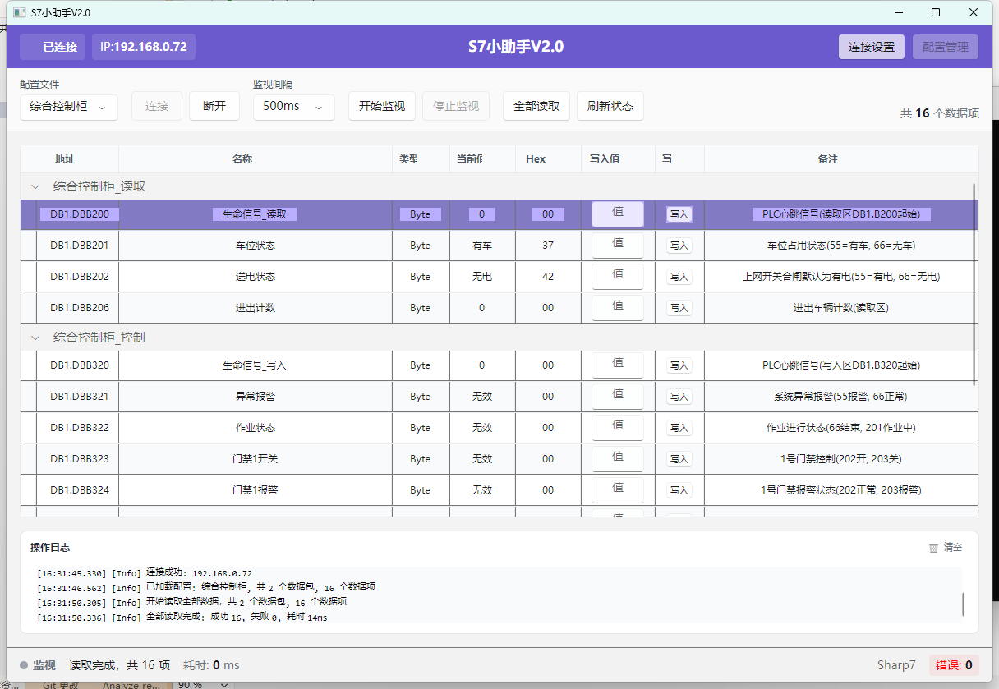

# S7 小助手 V2.0

一款基于 Avalonia UI 的跨平台 S7 PLC 调试工具，支持西门子 S7 系列PLC的数据读写、监视和配置管理。



## 功能特性

### 核心功能
- **PLC 连接管理** - 支持多 PLC 连接配置，可保存连接参数
- **数据读写** - 支持位、字节、字、双字、整数、双整数、实数等 S7 数据类型
- **实时监视** - 可配置刷新间隔的实时数据监视功能
- **配置管理** - JSON 格式的配置文件，支持导入/导出

### 支持的数据类型
| 类型 | 说明 | 字节数 |
|------|------|--------|
| Bit | 位 | 1 |
| Byte | 字节 | 1 |
| Word | 字 | 2 |
| Int | 整数 | 2 |
| DWord | 双字 | 4 |
| DInt | 双整数 | 4 |
| Real | 实数(浮点) | 4 |
| String | 字符串 | 变长 |

### 支持的通讯库
- **Sharp7** - 高性能 S7 通讯库
- **S7NetPlus** - .NET 标准库

## 系统要求

- Windows 10/11 或 Linux (x64/arm64)
- .NET 6.0 Runtime

## 快速开始

### 1. 连接 PLC
1. 点击「连接设置」按钮
2. 输入 PLC 的 IP 地址（如 `192.168.1.100`）
3. 选择 PLC 类型（S7-300/S7-400/S7-1200/S7-1500）
4. 点击「连接」按钮

### 2. 读写数据
1. 在数据项列表中点击「添加」按钮
2. 输入地址（如 `DB1.DBB0`、`DB1.DBX0.0`、`DB1.DBD0`）
3. 选择数据类型
4. 点击「读取」获取当前值
5. 输入新值后点击「写入」

### 3. 实时监视
1. 添加需要监视的数据项
2. 选择刷新间隔（50ms/100ms/200ms/500ms/1000ms）
3. 点击「开始监视」按钮

## 配置文件

配置文件位于 `config/` 目录下，使用 JSON 格式：

```json
[
  {
    "Name": "数据项名称",
    "Type": 1,
    "Address": "DB1.DBB0",
    "Length": 1,
    "Remark": "备注说明",
    "TypeValues": {
      "0": "关闭",
      "1": "开启"
    }
  }
]
```

### 配置字段说明
| 字段 | 类型 | 说明 |
|------|------|------|
| Name | string | 数据项名称 |
| Type | int | 数据类型（见枚举值） |
| Address | string | S7 地址格式 |
| Length | int | 数据长度（字符串类型时有效） |
| Remark | string | 备注说明 |
| TypeValues | object | 值映射字典（可选） |

### 数据类型枚举值
- 0: Bit（位）
- 1: Byte（字节）
- 2: Word（字）
- 3: Int（整数）
- 4: DWord（双字）
- 6: DInt（双整数）
- 7: Real（实数）
- 20: String（字符串）

## 地址格式

支持标准 S7 地址格式：

| 格式 | 示例 | 说明 |
|------|------|------|
| 位地址 | `DB1.DBX0.0` | DB1，偏移0，位0 |
| 字节地址 | `DB1.DBB0` | DB1，偏移0，字节 |
| 字地址 | `DB1.DBW0` | DB1，偏移0，字 |
| 双字地址 | `DB1.DBD0` | DB1，偏移0，双字 |

## 预置配置

### 综合控制柜
- 读取区: DB1.B200（16字节）
- 写入区: DB1.B320（16字节）
- 包含：车位状态、送电状态、门禁控制等

### 接地柜
- 读取区: DB1（16字节）
- 包含：接触网电压、操作模式、设备状态、告警状态等

## 项目结构

```
S7Assistant/
├── App.axaml              # 应用程序入口
├── Program.cs             # 主程序
├── config/                # 配置文件目录
│   ├── 综合控制柜.json
│   └── 接地柜.json
├── Converters/            # 值转换器
├── Core/                  # 核心接口和事件
├── Models/                # 数据模型
├── Services/              # 服务层
│   ├── ConfigService.cs   # 配置管理
│   ├── LogService.cs      # 日志服务
│   └── S7Client/          # PLC 客户端实现
├── ViewModels/            # 视图模型
└── Views/                 # 视图/界面
```

## 开发

### 构建项目
```bash
cd S7Assistant
dotnet build
```

### 运行项目
```bash
dotnet run
```

### 发布项目
```bash
dotnet publish -c Release -r win-x64 --self-contained
```

## 技术栈

- **UI 框架**: Avalonia UI 11.x
- **MVVM 框架**: CommunityToolkit.Mvvm
- **S7 通讯**: Sharp7 / S7NetPlus
- **日志**: Microsoft.Extensions.Logging
- **配置**: System.Text.Json

## 许可证

MIT License

## 更新日志

### v2.0.0
- 重构为 Avalonia UI 跨平台架构
- 支持多种 S7 数据类型
- 添加实时监视功能
- 添加配置文件管理
- 支持两种 S7 通讯库
